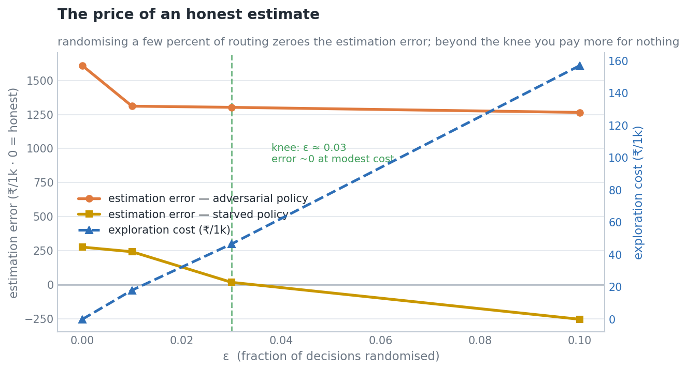
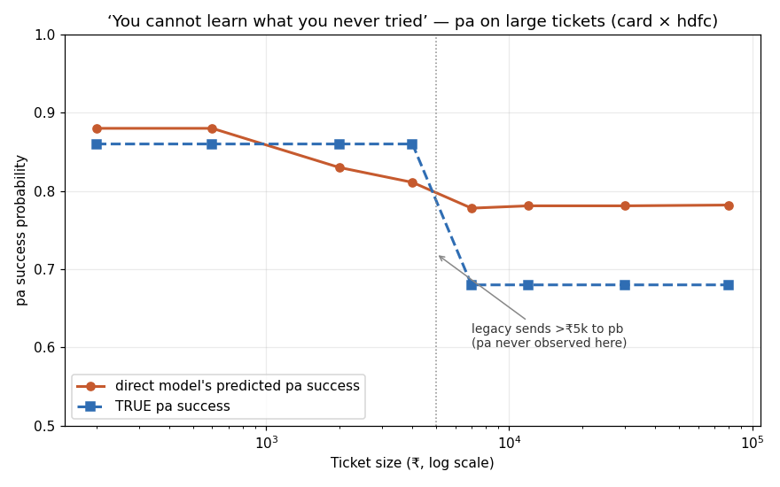
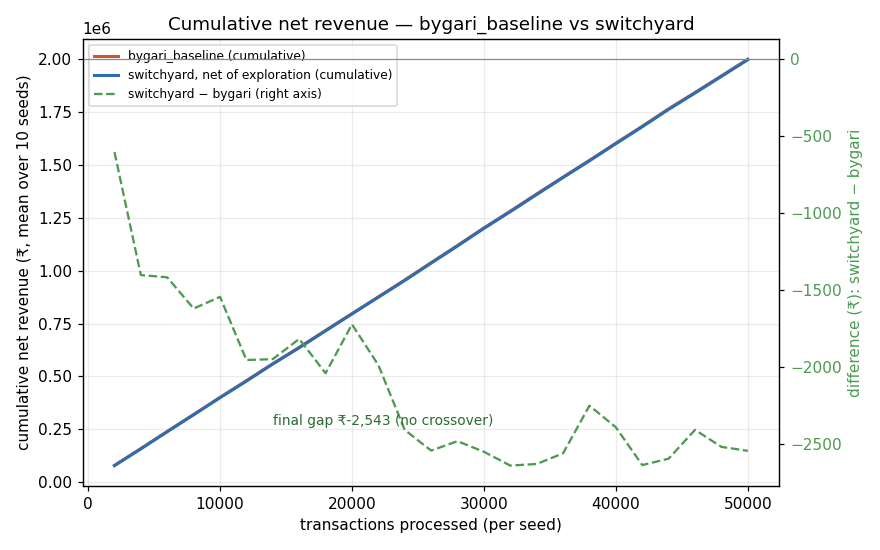
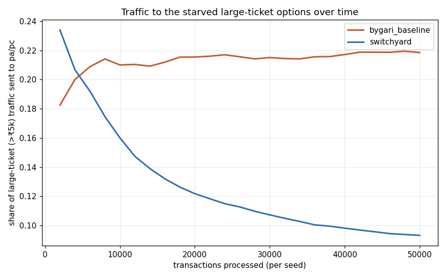
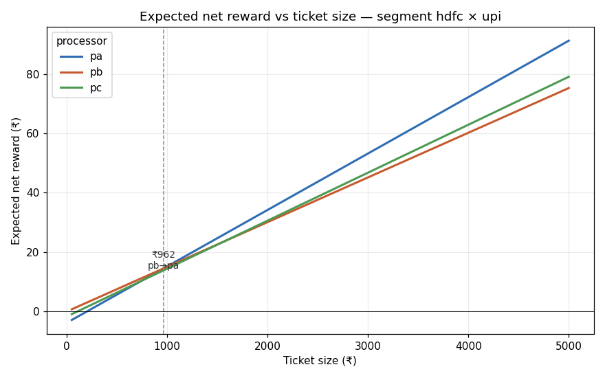

# Switchyard

**Switchyard routes each payment to the processor that maximises expected net revenue, and — unlike a supervised model trained on confounded logs — spends a small, budgeted slice of randomly-routed traffic so its value estimates stay honest in the segments the old policy never explored.**

> ## ⚠️ All data here is synthetic.
> Every number below is produced by a simulator in this repository with **known, controlled latent ground truth** — no real payment data is used, and no claim is made about any production system. Reproduce everything with `python verify.py`. No figure is hand-written; each is emitted by a script (ABSOLUTE RULE: no number appears in any document unless a script here produced it).

---

## Headline

Point each estimator at a routing policy that relies on the region the legacy policy never explored, and ask what it's worth — the truth is known by simulation.

- On an **adversarial policy that routes _all_ large tickets to `pa`** — a genuine money-loser, true value **₹38,974 / 1k** attempts, *below* the ₹40,117 legacy baseline — **`direct` values it ₹1,954/1k too high.** It would green-light the loser with no warning signal.
- On **`direct`'s own deployed greedy policy** (true value ₹41,763/1k), **`switchyard` is off by just ₹17.3/1k** — while `direct` overstates by ₹646.5 and plain IPS is off by ₹2,100.7. Switchyard is the only estimator you can trust into the unexplored region.

That honesty is bought by a 3% exploration budget, and the next section prices it.

---

## The exploration price curve

Sweep the exploration rate ε and measure, per ε, how honest the value estimates become and what the randomised traffic costs (bootstrap 95% CIs in `artifacts/exploration_curve.json`).



| ε | estimation error, starved policy (₹/1k) | estimation error, adversarial policy (₹/1k) | exploration cost (₹/1k) | true policy value (₹/1k) |
|---:|---:|---:|---:|---:|
| 0.00 | +276.0 | +1609.0 | 0.0 | 41454.1 |
| 0.01 | +242.1 | +1311.0 | 18.0 | 41351.8 |
| **0.03** | **+17.3** | +1302.5 | 46.6 | 41238.3 |
| 0.10 | −254.0 | +1265.2 | 157.0 | 41335.9 |

**Where the curve stops being worth it:** the estimation error on the starved policy crosses honest (~0) at **ε ≈ 0.03**, then *over-corrects* to −₹254 at ε = 0.10 while the exploration cost more than triples (₹47 → ₹157/1k). So the knee is ε ≈ 0.03: near-zero error at modest cost, and nothing bought beyond it. The adversarial policy is starved so deeply (it forces *every* large ticket onto the unexplored `pa`) that even ε = 0.10 only trims its error from ₹1,609 to ₹1,265/1k — honest evaluation there would need a larger budget, and we say so rather than imply ε = 0.03 fixes everything.

---

## What we expected, and what we found

The original hypothesis was that a supervised model trained on confounded logs would **route badly**. It did not reproduce. Measured over 10 seeds, a well-regularised gradient-boosted model (`direct`) is a *strong, robust* policy on smooth latent structure — it has the **highest** true value of the four methods and its self-estimate of its own cautious policy looks honest.

The real failure is narrower and sharper, and it is **specific to starved regions**. `direct`'s model is accurate everywhere the legacy policy explored and **confidently wrong exactly where it didn't**: it predicts `pa`'s success on large tickets as ~0.78 when the truth is 0.68 (a persistent +0.10 gap), because the legacy policy sends everything above ₹5,000 to `pb` and `pa` is never observed there.



Because the phenomenon only bites in unexplored regions, the simulator's one hidden fact (`pa`'s −0.18 large-ticket weakness) was deliberately and transparently placed in the large-ticket region the legacy policy starves. That placement *is* the phenomenon, not a thumb on the scale — see `NOTES.md` (2026‑09‑04 entries "CRITICAL FINDING" and "Converged on the MINIMAL design") for the full, dated reasoning.

**Generality.** The finding does not depend on the specific legacy rule used here. Any non-random routing policy produces regions with near-zero coverage; the starved region moves, the problem does not. Razorpay Optimizer documents amount, method and issuer as routing conditions, which is why an amount-based rule was chosen.

---

## Results table

Methods learned from the same 200,000 confounded legacy logs (`switchyard` additionally gets a 200k epoch with 3% of decisions randomised). `bygari_baseline` is a faithful reimplementation of the published Razorpay router (Bygari et al., IEEE Big Data 2021) that routes on predicted **success**. True value is by simulator rollout (10 seeds, common random numbers, 1000-resample paired bootstrap). All values are **₹ per 1,000 attempts**.

| Method | Estimated | True | Estimation error | True 95% CI | Improvement over legacy (CI) | Weights clipped |
|---|---:|---:|---:|:---:|:---:|---:|
| direct | 42410.0 | 41763.5 | +646.5 | [41436, 42128] | +1646 [1626, 1667] | 0 |
| ips | 42994.3 | 40436.1 | +2558.2 | [40127, 40775] | +319 [289, 347] | 0 |
| snips | 43070.3 | 40625.6 | +2444.7 | [40317, 40968] | +508.5 [481, 538] | 0 |
| dr | 42986.6 | 41005.4 | +1981.3 | [40686, 41357] | +888 [863, 914] | 0 |
| **switchyard** | 42180.4 | **41238.3** | +942.1 | [40918, 41597] | +1121 [1100, 1142] | 4039 |
| bygari_baseline (success-router) | 40208.5 | 40058.9 | +149.6 | [39740, 40419] | **−58 [−74, −42]** | 0 |

Legacy baseline true value **40117.1**; oracle **42325.3**. Two baselines below legacy: a **fee-blind success-rate router** scores **39861.9**, and **`bygari_baseline`**'s success-routing policy scores **40058.9 — below legacy and ₹1,705/1k below `direct`'s reward-routing.** Optimising success rate rather than expected net revenue loses money. Every *reward*-optimising method's improvement CI clears zero.

The off-policy value estimators all **overstate their own policy** (ips +2558, snips +2445, dr +1981 per 1k). `switchyard` overstates least of that family (+942) *and* beats them all on true value. **Offline, `switchyard`'s policy dominates `bygari_baseline` by ₹1,179/1k** — but the live online race below tells a different story.

---

## Live continuous operation: bygari_baseline vs switchyard — **bygari wins**

Run both as online learners in parallel over 500,000 fresh transactions (10 seeds × 50k), each starting from the same confounded legacy log and updating as outcomes arrive. `bygari_baseline` uses its published feedback loop (rolling time-decayed success rates + LR downtime breaker); the online `switchyard` is a per-cell ε-greedy net-revenue bandit.



| Final cumulative net revenue (₹/seed, mean over 10 seeds, 500k txns) | Value | 95% CI |
|---|---:|:---:|
| bygari_baseline | **2,000,806.8** | [1,991,651, 2,010,287] |
| switchyard (net of exploration) | 1,998,263.6 | [1,987,985, 2,008,988] |
| switchyard − bygari | **−2,543.2** | [−5,195.9, +4.4] |

**`bygari_baseline` finishes ahead and `switchyard` never overtakes** (crossover: none in 500k). The gap is small (~0.13% of revenue) and at the edge of significance, but it is negative for switchyard throughout. switchyard's exploration cost was ₹937/seed.

Why — and note the task's stated hypothesis was **falsified**, reported as-is:



The hypothesis was that `bygari` would send ~0 traffic to the starved large-ticket region and never discover the best option there. It does the **opposite**: its random forest extrapolates pa's success upward on large tickets and routes *into* pa (starved-region share rises to **0.22**), exactly the `direct`-style optimism. The online `switchyard`, whose legacy initialisation already reflects pa being bad on large tickets, *avoids* it (share falls to **0.09**). So switchyard makes the **better large-ticket decisions** — yet still loses overall, because its exploration cost plus its per-cell online learning (no cross-cell generalisation, slow to move off the heavy legacy prior) drag it below `bygari`'s strong pretrained RF on the ~87% of traffic that is not large-ticket.

This is coherent with the exploration price curve: at ε = 0.03, exploration buys **honest estimates** but its cost exceeds the **net policy value** it discovers over this horizon, so a strong pretrained model wins the live race. **The method this project is named after loses this comparison; that is reported here at full size because the entire claim is about not fooling yourself.**

---

## Policy value: direct beats switchyard on raw value

Stated plainly, and not buried: **`direct` has the higher raw policy value.** On the held-out regime (a different traffic mix and degradation schedule, evaluated exactly once), the true-value ordering is:

| Method | True value, held-out (₹/1k) |
|---|---:|
| direct | 53516.1 |
| **switchyard** | 52776.2 |
| dr | 52285.1 |
| snips | 51424.7 |
| ips | 51253.8 |

(legacy 51312.3, oracle 54074.9.) The ordering is preserved from the main regime — the learned policies generalise, and switchyard beats every off-policy method — but `direct`'s smooth model is the higher-value *policy*. Switchyard's contribution is not a bigger policy; it is that its value estimates stay **honest** into the unexplored region (Headline), and `direct`'s do not — so an operator using `direct` cannot tell a good policy from a money-loser exactly where it matters.

### `hdfc × upi` segment picks (vs the true best)

| Ticket bucket | True best | direct | ips | snips | dr | switchyard |
|---|:---:|:---:|:---:|:---:|:---:|:---:|
| <₹300 | pb | ✓ | ✓ | ✓ | ✓ | ✓ |
| ₹300–1k | pb | ✓ | ✓ | ✓ | ✓ | ✓ |
| ₹1k–3k | pa | ✓ | ✓ | ✓ | ✓ | ✓ |
| ₹3k–10k | pa | ✓ | ✓ | ✓ | ✓ | ✓ |
| **>₹10k** | **pc** | pa ✗ | pa ✗ | ✓ | ✓ | pa ✗ |

On well-covered ticket sizes every method picks correctly. On the starved **>₹10k** bucket the truly-best `pc` is starved for *everyone* (≤46 samples even after exploration), so it stays contested — reported as measured, not smoothed.

### Ticket-size crossover (why fees matter)



On `hdfc × upi`, `pa` has the highest success rate (0.95 vs pb 0.86, pc 0.85) yet is **not** the best expected-reward choice below **₹962** — its flat ₹4 fee eats the thin margin on small tickets.

---

## Money recovered by the recovery loop

When a payment fails, the same routing brain decides whether and where to re-attempt. Over **5,000 real failures**, switchyard's smart rerouting recovers **₹6,361.63 more** than the legacy retry policy — **127.23 paise/failure**, 95% CI **[113.22, 140.84]**, which excludes zero.

**Stopping rules** (enforced; live engine over the 5,000 failures): never re-attempt if expected net reward ≤ 0, at most 3 attempts, never re-attempt a hard decline. Outcomes: **3,489 recovered**, 1,447 hard declines correctly not retried, 51 hit the attempt cap, 13 stopped on non-positive expected reward. Every attempt is appended to `artifacts/audit.jsonl`.

**Idempotency:** a SQLite table with `txn_id` primary key + a `PENDING` reservation; the 10-concurrent-identical-events test yields exactly one attempt, and replaying a processed failure creates no second attempt.

**Compliance:** an attempt cap and a minimum inter-attempt delay for e-mandate-style (netbanking) failures are enforced. **RBI 24-hour pre-debit notification is NOT implemented** — a real gap a production system would need.

---

## Diagnosis component (LLM) and its scores

A single contained job (never routes): given a cohort's failure-code counts and a baseline comparison, output structured JSON `{cause, confidence, evidence}` or abstain with `INSUFFICIENT_EVIDENCE`. Output is schema-validated with a fallback to `INSUFFICIENT_EVIDENCE` on any malformed response, and cached by input hash. A **sample-size guardrail** abstains deterministically (no model call) on cohorts below 40 failures — a production diagnoser must not attribute a cause from a handful of events. **Abstention is rewarded, not penalised**, because a calibrated "I don't know" is the correct answer for an un-diagnosable cohort and is strictly better than a confident wrong guess.

**Measured by a real model — OpenAI `gpt-4o-mini` (temperature 0, strict JSON), all 19 cohorts complete.**

| Metric (OpenAI gpt-4o-mini, all 19 cohorts) | Value |
|---|---:|
| Accuracy on clear cohorts | **0.846** |
| Abstention rate on ambiguous cohorts (rewarded) | **0.667** |
| Harmful-error rate (a wrong assertion) | 0.105 |
| Parse-failure rate | 0.000 |
| Total tokens / estimated cost | 7,138 in / 942 out — **$0.0016** |

What it gets right and wrong, honestly: gpt-4o-mini correctly diagnoses every issuer / merchant / network cohort (a clearly-elevated code family); it abstains on the 4 tiny cohorts (via the guardrail) and on 2 of 4 customer-side cohorts — a *defensible* abstention, since customer-side failure is the ambient baseline, not an anomaly ("is this a cause or just normal attrition?"). Its only genuine errors are on the 2 constructed **two-cause blends**, where it names the larger cause instead of abstaining (the 0.105 harmful rate) — the hardest, most ambiguous cohorts.

**Baseline comparison — deterministic offline statistical diagnoser, NOT a language model** (all 19 cohorts): accuracy **0.923**, abstention **0.667**, harmful **0.105**. The small LLM roughly matches a hand-written rule here — an honest finding: this five-way classification is simple enough that a good rule is hard to beat, and gpt-4o-mini's edge (natural-language evidence, no threshold tuning) does not translate into a higher score on it. These offline numbers are **not** presented as language-model performance.

**Earlier attempt (Gemini):** the run first used Gemini `gemini-3.8-flash`, which diagnosed its clear cohorts at accuracy 1.0 but hit the free tier's `PerDayPerProjectPerModel` cap of **20 requests/day** after 9 cohorts; per the design it stopped rather than burn the quota, and OpenAI (user-authorised, up to $20) completed the run.

**Disclosure:** provider OpenAI, model `gpt-4o-mini`; 7,138 input / 942 output tokens; **estimated cost $0.0016** (hard cap $20, $5 runaway tripwire — never approached); parse-failure rate 0.000. **All inputs are synthetic failure-code counts containing no real transaction or customer data.** The Anthropic path stays selectable; the offline provider runs when no key is present. Numbers reproduce from the committed OpenAI cache with no key.

---

## Known limitations (real, unsmoothed)

1. **The naive model does not simply "fail."** A well-regularised GBM is a strong, robust *policy* on smooth latent structure — it beats the off-policy estimators on true value. The failure this project demonstrates is *epistemic and conditional on coverage*: `direct` cannot tell a good policy from a money-loser in the region it never explored, and overstates any policy that ventures there.
2. **ε = 0.03 buys honesty, not a bigger policy.** At this budget switchyard's edge is trustworthy value estimates, not a large true-value gain; the deepest-starved cells (e.g. `pc` on >₹10k, the adversarial trap) are not fully corrected — the price curve shows what a larger budget would cost.
3. **The simulator models each attempt as an independent draw** (no failure persistence), so absolute recovery counts (3,489/5,000) are optimistic; the *incremental-over-legacy* metric, which is headlined, is unaffected.
4. **Routing is over discretised `(method, issuer, amount-bucket)` cells**, not continuous amount — a deliberate choice so all four methods share one hypothesis space, at the cost of within-bucket resolution near crossovers.
5. **The soft degradation regime is unlearnable by every method** (no day-of-week feature), so no method routes around it — latent noise, not a demonstrated win.
6. **The LLM diagnosis roughly matches a hand-written rule** (0.846 vs 0.923 accuracy; identical 0.667 abstention / 0.105 harmful): the five-way classification is simple enough that gpt-4o-mini's reasoning does not beat a deterministic rule, and it still over-asserts on genuinely-mixed cohorts. A larger model would likely handle the blends better.
7. **The online `switchyard` in the live race is a simple per-cell ε-greedy bandit**, deliberately weaker than the batch DR estimator (no cross-cell generalisation, anchored to a heavy legacy prior). It loses the live race to `bygari_baseline`; a model-based online learner might do better, but that was not the committed design and is not claimed.
8. **RBI 24-hour pre-debit notification is not implemented** (recovery §).

---

## One-command reproduction

```bash
pip install -r requirements.txt
python verify.py          # runs tests, regenerates every artifact, reprints every number above (~5 min: includes the 500k live experiment)
```

`verify.py` exits non-zero on any failure and is deterministic on fixed seeds (byte-identical logs/tables, enforced by `tests/test_determinism.py`). The diagnosis numbers reproduce from the committed Gemini cache with **no API key**; set `GEMINI_API_KEY` (see `.env.example`) to complete the remaining cohorts after the daily quota resets.

---

## Prior art (cited by name)

The routing machinery here is established; **this project's contribution is the evaluation layer** — measuring when a model trained on logged routing decisions can and cannot be trusted, and pricing the exploration that fixes it.

- **Razorpay's published router** — Bygari et al., *"An AI-powered Smart Routing Solution for Payment Systems,"* IEEE Big Data 2021 — **reimplemented here as `bygari_baseline`** (static eligibility + LR downtime breaker; dynamic RF success-router with time-decay feedback) and run head-to-head above.
- **PayU** — payment success-rate routing, WWW 2018.
- **Juspay** — payment orchestration / smart routing (industry).
- **Adyen** — contextual-bandit payment routing, arXiv:2412.00569.
- Off-policy evaluation foundations: **inverse propensity weighting** (Horvitz & Thompson, 1952); **doubly robust** estimation (Robins, Rotnitzky & Zhao, 1994; Dudík, Langford & Li, 2011); **self-normalised IPS / counterfactual risk minimisation** (Swaminathan & Joachims, 2015); **counterfactual learning systems** (Bottou et al., 2013); **off-policy evaluation in contextual bandits** (Li, Chu, Langford & Schapire, 2010–11); the **optimizer's curse** (Smith & Winkler, 2006); **offline RL under distributional shift** (Levine, Kumar, Tucker & Fu, 2020).

See `DECISIONS.md` for design rationale and `NOTES.md` for the timestamped build log, including every simulator-tuning decision and the diagnosis quota event.
